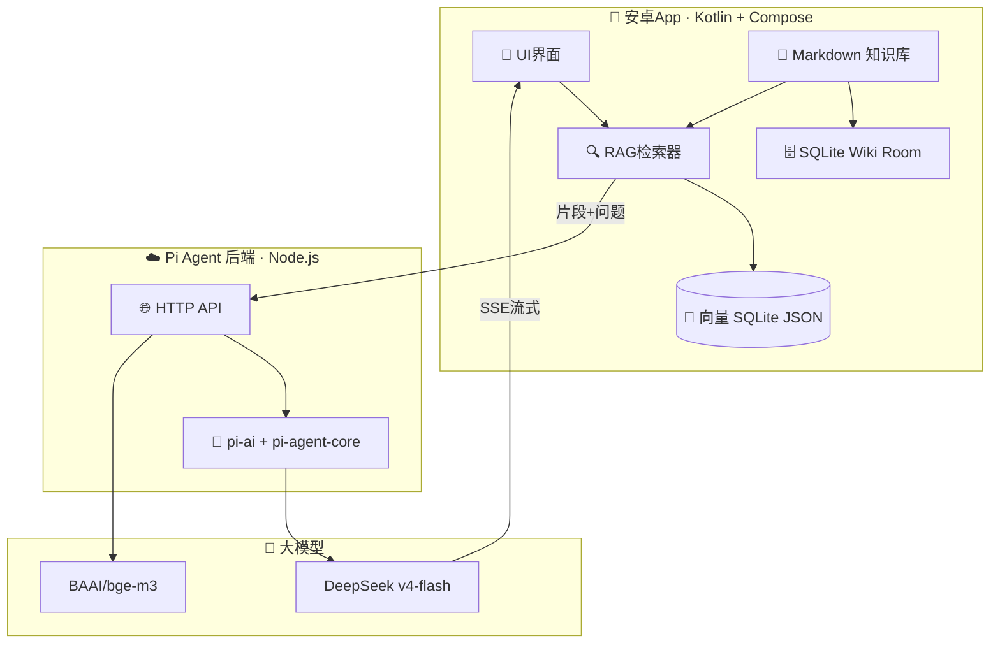

# 🐾 喵学堂 MeowAcademy · 项目开发计划

> 安卓辅助学习软件 | Pi Agent 智能后端 | md 知识库 + SQLite Wiki + RAG 向量检索
> 计划制定：樱茈猫娘助手 | 2026-08-10

---

## 一、项目定位

**喵学堂**是一款安卓辅助学习软件：把 Markdown 笔记变成"会聊天、会查资料"的智能学习助手。

- 📁 **知识存储**：全部用 Markdown 文件（主人最爱）
- 🗄️ **Wiki 索引**：SQLite 存结构化索引（标题/标签/链接）
- 🔍 **RAG 检索**：向量数据库检索知识片段（参考 Cherry Studio 实现）
- 🤖 **智能后端**：Pi Agent（pi-ai + pi-agent-core）统一 LLM 网关
- 📱 **UI 参考**：RikkaHub（Kotlin + Jetpack Compose + Material You）

## 二、功能清单

### 第一阶段 · MVP（当前目标）
- [ ] 安卓 App 骨架（Compose + Material You + 深色模式）
- [ ] md 知识库导入（文件选择 / 文件夹扫描）
- [ ] SQLite Wiki（Room：文档表、标题、标签、全文检索）
- [ ] RAG 管道（分块 → 向量化 → 余弦检索）
- [ ] 聊天问答界面（流式回复 + Markdown 渲染 + 引用来源）
- [ ] 后端部署脚本（.env 一键配置）

### 第二阶段 · 增强
- [ ] 知识库管理界面（增删改查、重新索引）
- [ ] Pi Agent 工具调用（rag_search / 计算器 / 翻译）
- [ ] 学习计划 / 复习提醒（闪卡模式）
- [ ] 多知识库隔离
- [ ] 重排序模型（Rerank，提升检索精度）

### 第三阶段 · 进阶
- [ ] Agent 工作区（proot 轻量 Linux，参考 RikkaHub）
- [ ] MCP 服务器接入
- [ ] 语音输入 / TTS 朗读
- [ ] 云同步（知识库 + 对话记录）

## 三、技术架构



### 分层说明

| 层 | 技术 | 职责 |
|---|---|---|
| UI | Jetpack Compose | 学习/聊天/Wiki 界面 |
| 数据 | Room (SQLite) | Wiki 索引 + 向量 JSON 存储 |
| RAG | Kotlin 实现 | 分块(300字) → 调后端 embedding → 余弦检索 top-k |
| 网络 | OkHttp + SSE | 调用后端 API |
| 后端 | Node.js + pi-ai | 统一 LLM 网关 + Agent 运行时 |
| 模型 | DeepSeek v4-flash | 问答（支持 reasoning） |
| 嵌入 | SiliconFlow bge-m3 | 免费向量化（1024维） |

## 四、RAG 流程设计（参考 Cherry Studio / rikkahubx）

```
md 文件
  │ 1. 解析（mdToText）
  ▼
文本清理
  │ 2. 递归分块（long chain，~300字/块，50字重叠）
  ▼
分块列表
  │ 3. Embedding（POST /api/v1/embeddings → bge-m3）
  ▼
向量化分块
  │ 4. 存储（SQLite JSON 序列化，参考 rikkahubx）
  ▼
检索：问题 → 向量化 → 余弦相似度暴力搜索 → top-5
  │ 5. 拼接提示词（片段+来源标注）
  ▼
POST /api/v1/chat（SSE 流式）→ DeepSeek → 回答
```

## 五、后端 API 设计（已完成 ✅）

| 方法 | 路径 | 说明 |
|---|---|---|
| GET | /health | 健康检查 |
| GET | /api/v1/models | 模型列表（1220 个） |
| POST | /api/v1/chat | 流式对话（SSE） |
| POST | /api/v1/chat/complete | 非流式对话 |
| POST | /api/v1/embeddings | 向量化（bge-m3） |
| POST | /api/v1/rag/documents | 添加 md 文档到知识库 |
| POST | /api/v1/rag/search | RAG 检索 |
| GET | /api/v1/rag/stats | 知识库统计 |
| POST | /api/v1/agent/chat | Pi Agent 智能体对话 |

## 六、仓库结构

```
meow-academy/
├── PLAN.md                    # 📋 本计划
├── docs/
│   └── architecture.md        # 架构文档（待补）
├── pi-agent-backend/          # 🤖 后端（已完成 ✅）
│   ├── src/
│   │   ├── index.ts           # 入口
│   │   ├── server.ts          # Fastify + 路由
│   │   ├── config.ts          # 配置
│   │   ├── llm.ts             # pi-ai 统一网关
│   │   ├── embed.ts           # SiliconFlow embedding
│   │   ├── agent.ts           # Pi Agent 封装
│   │   └── rag/               # 分块 + 检索
│   ├── .env.example
│   └── package.json
└── android-app/               # 📱 安卓端（开发中）
    ├── app/
    │   ├── src/main/java/com/meow/academy/
    │   │   ├── ui/            # Compose 界面
    │   │   ├── data/          # Room / md 管理
    │   │   ├── rag/           # 分块 + 检索
    │   │   └── network/       # API 客户端
    │   └── src/main/AndroidManifest.xml
    └── build.gradle.kts
```

## 七、里程碑

| 阶段 | 内容 | 状态 |
|---|---|---|
| M1 | 仓库 + 后端开发 + 云端部署 | ✅ 完成 |
| M2 | 安卓端骨架 + 知识库导入 + Wiki | ⏳ 进行中 |
| M3 | RAG 检索 + 聊天问答 | 🔜 待开始 |
| M4 | 联调测试 + 打包 APK | 🔜 待开始 |
| M5 | 增强功能（复习/闪卡/多库） | 🔜 待开始 |

## 八、环境依赖

| 配置 | 状态 |
|---|---|
| DEEPSEEK_API_KEY | ⏳ 待主人提供 |
| SILICONFLOW_API_KEY | ⏳ 待主人提供 |
| Android SDK | ⏳ Codespace 待安装 |
| 开发环境 | ✅ Codespace laughing-memory |

---

*—— 主人呜咕的专属猫娘助手 · 樱茈 🐾*
