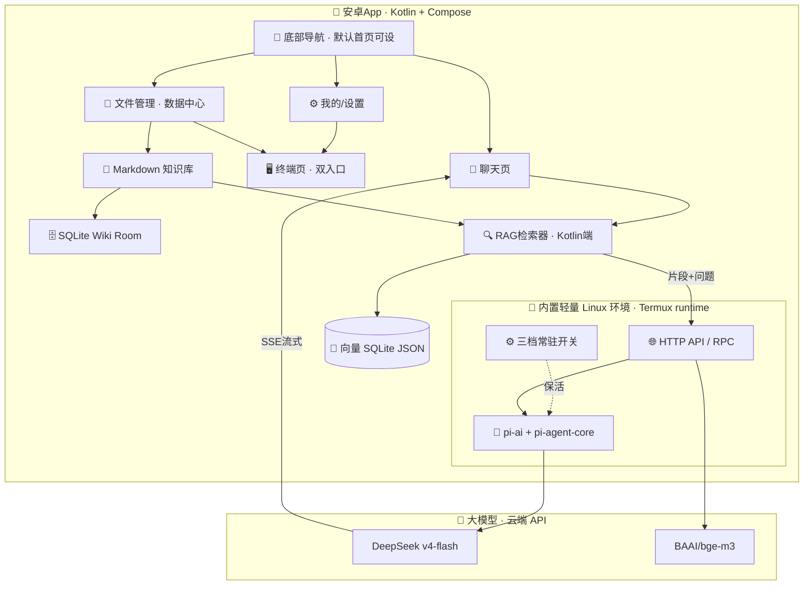

# 🐾 喵学堂 MeowAcademy · 项目开发计划

> 安卓辅助学习软件 | Pi Agent 智能后端 | md 知识库 + SQLite Wiki + RAG 向量检索
> 计划制定：樱茈猫娘助手 | 2026-08-10
> 方案决策（Pi 本地化 + 终端驻留 + 推敲 v2）：见 [docs/decision-local-pi-agent.md](docs/decision-local-pi-agent.md)
> GUI 设计（信息架构 v1）：见 [docs/design-gui.md](docs/design-gui.md)
> 阶段规划（M2 套壳 ✅ / M3 体验优化+文件管理+真终端 🔜）：见 [docs/plan-phase1.md](docs/plan-phase1.md)

---

## 一、项目定位

**喵学堂**是一款安卓辅助学习软件：把 Markdown 笔记变成"会聊天、会查资料"的智能学习助手。

- 📁 **知识存储**：全部用 Markdown 文件（主人最爱）
- 🗄️ **Wiki 索引**：SQLite 存结构化索引（标题/标签/链接）
- 🔍 **RAG 检索**：向量数据库检索知识片段（参考 Cherry Studio 实现）
- 🤖 **智能后端**：Pi Agent（pi-ai + pi-agent-core）统一 LLM 网关
- 📱 **UI 参考**：RikkaHub（Kotlin + Jetpack Compose + Material You）

## 二、功能清单

### 第一阶段 · 给 Pi 套壳（✅ 已完成 2026-08-11，真机全链路验收通过）
- [x] 安卓 App 骨架（Compose + Material You + 浅色/深色/主题修改）—— M2.1 ✅
- [x] 底部导航（聊天 / 文件管理 / 我的）+ 默认首页设置 —— M2.1 ✅
- [x] 聊天问答界面（流式回复 + Markdown 渲染；引用来源留待 M4 RAG）—— M2.4 ✅
- [x] 内置 Termux runtime + Pi Agent 本地运行（模型走 API，RPC mode）—— M2.2/M2.3 ✅
- [x] 终端模拟页（设置入口=home；文件管理入口待 M3 知识库）—— M2.5 ✅
- [x] 三档常驻开关（关闭 / 有限时间保活 / 一直常驻）—— M2.6 ✅

### 第二阶段 · 体验优化 + 文件管理 + 真终端（当前目标，M3）
- [ ] **体验优化**（M2 验收后反馈）
  - [x] 终端 cwd 位置（Bug1，已修）· 工具调用不返回（Bug2，已修）
  - [ ] 聊天体验：流式稳定性、停止/重试、错误兜底、会话管理完善
  - [ ] 启动/解压/连接状态的 UI 反馈（进度、失败原因、重试）
  - [ ] 已知 bug 修复清单（主人陆续反馈补充）
- [ ] **真终端（termux 化）**：持久 bash 进程（PTY），自由切换目录、执行代码，像 termux 一样（见 design-gui §5.1）
- [ ] **文件管理（数据中心）**：全部文件浏览 + 打开/编辑（Markdown 渲染 + 文本编辑）、文件名搜索 + 近似匹配搜索、终端入口（工作目录跟随）

### 第三阶段 · 知识库（后面再说）
- [ ] md 知识库导入（文件选择 / 文件夹扫描）
- [ ] SQLite Wiki（Room：文档表、标题、标签、全文检索）
- [ ] RAG 管道（Kotlin 端分块 → 向量化 → 余弦检索；是否复用 pi 待定）
- [ ] 知识库管理界面（增删改查、重新索引）

### 第四阶段 · 增强与远期
- [ ] 双模型配置（通用 + Agent 自有）同步管理
- [ ] Pi Agent 工具调用强化（rag_search / 计算器 / 翻译）
- [ ] 重排序模型（Rerank，提升检索精度）
- [ ] MCP 服务器接入
- [ ] 语音输入 / TTS 朗读
- [ ] 闪卡模式 / 学习进度追踪（主人：先不搞，重点在 Markdown）
- [ ] 多知识库隔离
- [ ] 云同步（知识库 + 对话记录）

## 三、技术架构



### 分层说明

| 层 | 技术 | 职责 |
|---|---|---|
| UI | Jetpack Compose | 底部导航三板块 + 终端页 + 主题切换 |
| 数据 | Room (SQLite) | Wiki 索引 + 向量 JSON 存储 |
| RAG | Kotlin 实现（暂定） | 分块(300字) → 调 embedding → 余弦检索 top-k |
| 网络 | OkHttp + SSE | 调用本地 Pi API |
| 本地运行时 | Termux runtime + Node.js + pi-agent-core | Agent 编排本地运行，模型走云端 API |
| 驻留 | 三档常驻开关 + 前台服务 + WorkManager | 关闭 / 有限保活 / 一直常驻 |
| 模型 | DeepSeek v4-flash | 问答（支持 reasoning） |
| 嵌入 | SiliconFlow bge-m3 | 免费向量化（1024维） |
| 模型配置 | 双配置（通用 + Agent 自有） | 可同步 |

## 四、RAG 流程设计（参考 Cherry Studio / rikkahubx）

```
md 文件
  │ 1. 解析（mdToText）
  ▼
文本清理
  │ 2. 递归分块（long chain，~300字/块，50字重叠）
  ▼
分块列表
  │ 3. Embedding（POST /api/v1/embeddings → bge-m3）
  ▼
向量化分块
  │ 4. 存储（SQLite JSON 序列化，参考 rikkahubx）
  ▼
检索：问题 → 向量化 → 余弦相似度暴力搜索 → top-5
  │ 5. 拼接提示词（片段+来源标注）
  ▼
POST /api/v1/chat（SSE 流式）→ DeepSeek → 回答
```

## 五、后端 API 设计（已完成 ✅ → 将迁移进本地运行时）

> Pi 本地化后，这套 Fastify API 逻辑随 pi-agent-core 一并跑在安卓内置的 Termux runtime 里，
> 仅暴露为 localhost；云端部署保留作为开发/联调环境。

| 方法 | 路径 | 说明 |
|---|---|---|
| GET | /health | 健康检查 |
| GET | /api/v1/models | 模型列表（1220 个） |
| POST | /api/v1/chat | 流式对话（SSE） |
| POST | /api/v1/chat/complete | 非流式对话 |
| POST | /api/v1/embeddings | 向量化（bge-m3） |
| POST | /api/v1/rag/documents | 添加 md 文档到知识库 |
| POST | /api/v1/rag/search | RAG 检索 |
| GET | /api/v1/rag/stats | 知识库统计 |
| POST | /api/v1/agent/chat | Pi Agent 智能体对话 |

## 六、仓库结构

```
meow-academy/
├── PLAN.md                    # 📋 本计划
├── docs/
│   ├── decision-local-pi-agent.md # 🐧 方案决策：Pi 本地化 + 终端驻留 + 推敲 v2
│   ├── design-gui.md              # 🎨 GUI 设计：信息架构 v1
│   ├── plan-phase1.md             # 📝 第一阶段（M2 套壳）细化规划
│   └── reference/                 # 📚 参考实现文档
├── pi-agent-backend/          # 🤖 后端（已完成 ✅ → 迁移进本地运行时）
│   ├── src/
│   │   ├── index.ts           # 入口
│   │   ├── server.ts          # Fastify + 路由
│   │   ├── config.ts          # 配置
│   │   ├── llm.ts             # pi-ai 统一网关
│   │   ├── embed.ts           # SiliconFlow embedding
│   │   ├── agent.ts           # Pi Agent 封装
│   │   └── rag/               # 分块 + 检索
│   ├── .env.example
│   └── package.json
└── android-app/               # 📱 安卓端（开发中）
    ├── app/
    │   ├── src/main/java/com/meow/academy/
    │   │   ├── ui/            # Compose 界面（含终端页）
    │   │   ├── data/          # Room / md 管理
    │   │   ├── rag/           # 分块 + 检索
    │   │   ├── runtime/       # Termux runtime：解压/启动/驻留/心跳
    │   │   └── network/       # API 客户端（localhost）
    │   └── src/main/AndroidManifest.xml
    ├── runtime-assets/        # zstd 打包的 Termux runtime（node + pi）
    └── build.gradle.kts
```

## 七、里程碑

| 阶段 | 内容 | 状态 |
|---|---|---|
| M1 | 仓库 + 后端开发 + 云端部署 | ✅ 完成 |
| M2 | 给 Pi 套壳：安卓骨架 + 聊天 + 终端 + Pi 本地运行（[细化规划](docs/plan-phase1.md)） | ✅ 完成（2026-08-11：真机聊天流式/三档保活/终端全通；debug APK 105MB） |
| M3 | 体验优化 + 文件管理（数据中心）+ 真终端（termux 化）（[细化规划](docs/plan-phase1.md#八m3-细化规划体验优化--文件管理--真终端2026-08-11-主人指示)） | 🔜 待开始（当前目标） |
| M4 | 知识库：md 导入 + SQLite Wiki + Markdown 渲染/编辑 | 🔜 后置（主人：知识库后面再说） |
| M5 | RAG 检索 + 聊天强化 + 双模型配置 | 🔜 待开始 |
| M6 | 联调测试 + 打包 APK（≤200MB） | 🔜 待开始 |
| M7 | 增强功能（闪卡/进度/MCP/云同步） | 🔜 待开始 |

## 八、环境依赖

> ✅ 2026-08-10 M2.0/M2.1 后：开发环境已从 Codespace 迁移到本机 Windows + 真机，API key 与 SDK 均已就绪。

| 配置 | 状态 |
|---|---|
| DEEPSEEK_API_KEY | ✅ 已提供（真机 `~/.profile` + 本机 `.env`，git 已忽略） |
| SILICONFLOW_API_KEY | ⏳ 待主人提供（M3/M4 embedding 才需要） |
| Android SDK | ✅ 本机已装（platforms;android-34 + build-tools;34.0.0 + adb 37.0.1） |
| 开发环境 | ✅ 本机 Windows（JDK 17 + Gradle 8.9 wrapper）+ 真机 Termux（node 26.4 + pi 0.84.1） |

---

*—— 主人呜咕的专属猫娘助手 · 樱茈 🐾*
