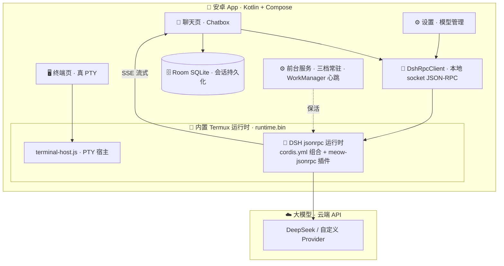

# 🐾 喵学堂 MeowAcademy

> 把 Markdown 笔记变成"会聊天、会查资料"的安卓辅助学习软件。
> **md 知识库 + SQLite Wiki + RAG 向量检索 + DeepSeek Harness（DSH）智能后端**

| 状态 | 信息 |
| --- | --- |
| 最新版本 | `0.1.0`（debug） |
| 平台 | Android 8.0+（minSdk 26 / targetSdk 34） |
| 技术栈 | Kotlin · Jetpack Compose · Material 3 · Room · DSH JSON-RPC |
| 后端 | 内置 DeepSeek Harness 运行时（真终端 PTY + 本地 socket） |
| 模型 | 云端 API（DeepSeek，可选自定义 Provider），无本地模型 |

---

## ✨ 功能亮点

- 💬 **Chatbox 化聊天体验**：会话抽屉 + 新会话 + 流式回答，思考 / 文本 / 工具调用**步骤化有序渲染**（折叠工具组、自动贴底跟随）
- 🗃️ **会话持久化**：Room（SQLite）双表存储会话与消息，App 重启后模型记得上下文（DSH 侧 `agents.resume()` 恢复）
- 🖥️ **真终端（Termux 化）**：持久 PTY bash 进程，自由切换目录、执行代码，支持 ANSI 转义渲染
- 🤖 **内置 DSH 智能后端**：DeepSeek Harness 跑在 App 内置 Linux 运行时里，聊天经**本地 socket JSON-RPC** 通信（非 HTTP）
- 🛠️ **Agent 工具全可用**：`bash` / `read` / `write` / `edit` / `str_replace_editor` / `web_search`（网络搜索）/ `todo_write`
- ⚙️ **模型管理**：运行时切换模型、思考强度（off / high / max）、可配置自定义 Provider（OpenAI 兼容格式）
- 🔋 **三档常驻策略**：关闭 / 有限时间保活 / 一直常驻（前台服务 + WorkManager JSON-RPC 心跳）
- 🎨 **Material You**：浅色 / 深色 / 跟随系统，动态取色
- 📖 **Markdown 渲染**：Markwon（表格 / 图片 / 链接）

> 📁 知识库（md 导入 + SQLite Wiki + RAG 检索）在后续里程碑规划中，见 [路线图](#-路线图)。

---

## 🧱 技术架构



**核心链路**：App 启动 → 解压 `runtime.bin` → `linker64` 拉起 node 运行 `terminal-host.js`（内置 PTY bash）→ DSH 作为 bash 子进程运行 → 聊天 / 终端均经本地 socket 走 JSON-RPC 2.0 → 模型请求发往云端 API。

**DSH 组合与插件**：`android-app/runtime-assets/dsh/cordis.yml` 定义了喵学堂的 Agent 组合（llm-deepseek / bash / agent-spine / 可配置 Provider 等）；`meow-extensions/meow-jsonrpc.js` 是自定义 Cordis 插件，扩展了官方 jsonrpc server（`session/cancel`、`session/bash`、`session/setModel`、`ping`、`agents.resume()` 跨进程会话恢复）。

---

## 🎯 里程碑状态

| 阶段 | 内容 | 状态 |
| --- | --- | --- |
| M1 | 后端网关（Fastify + pi-ai + RAG，云端） | ✅ 完成 |
| M2 | 安卓套壳：聊天 / 终端 / 设置 / 三档常驻 | ✅ 完成（2026-08-11 真机验收） |
| M2.8 | Pi Agent → **DeepSeek Harness** 替换 + 体积精简 | ✅ 完成（2026-08-14） |
| M2+ | 真终端（PTY bash）提前落地，DSH 跑在真终端里 | ✅ 完成（2026-08-15 真机验证） |
| M3 | 会话持久化 + Chatbox 化 + 模型管理 + 网络搜索 | ✅ 完成（2026-08-15 真机验证） |
| M4 | 知识库：md 导入 + SQLite Wiki + Markdown 编辑 | 🔜 后置 |
| M5 | RAG 检索 + 聊天强化 + 双模型配置 | 🔜 待开始 |
| M6 | 联调测试 + 打包 APK（≤200MB） | 🔜 待开始 |
| M7 | 增强：闪卡 / 进度 / MCP / 云同步 | 🔜 待开始 |

---

## 🚀 快速开始

### 环境要求

- JDK 17
- Android SDK（platforms;android-34 + build-tools;34.0.0）
- 真机（Android 8.0+）用于完整链路验证

> WSL 构建环境可直接 `source scripts/dev-env-wsl.sh` 一键就绪（JDK / SDK / 镜像源均已配好）。

### 构建 APK

```bash
cd android-app
./gradlew assembleDebug
```

构建产物自动同步到 `release/meow-academy-0.1.0-debug.apk`（约 89MB，内置 DSH 运行时 `runtime.bin` 约 67MB）。

### 安装到真机

```bash
adb install -r release/meow-academy-0.1.0-debug.apk
```

首次启动会自动解压内置运行时并拉起 DSH 进程，**需在设置页填入 `DEEPSEEK_API_KEY`**（或通过模型管理配置自定义 Provider）后即可对话。

---

## 🔧 重打内置运行时（进阶）

内置 DSH 运行时以 `runtime.bin`（gzip 打包的闭包）存放于 `android-app/app/src/main/assets/`。分两步重打：

```bash
# 1. PC 端：从仓库内 DSH fork 生成闭包（需 node + pnpm）
bash android-app/runtime-assets/build-dsh-closure.sh   # 产物 .tmp/dsh-closure.tar.gz (~19MB)

# 2. 真机 Termux：打包成 runtime.bin 并拷回 assets
adb push .tmp/dsh-closure.tar.gz android-app/runtime-assets/build-runtime.sh android-app/runtime-assets/dns-shim.js /data/local/tmp/
adb shell 'cp /data/local/tmp/dsh-closure.tar.gz /data/local/tmp/build-runtime.sh /data/local/tmp/dns-shim.js ~/ && chmod +x ~/build-runtime.sh && ~/build-runtime.sh ~/dsh-closure.tar.gz'
adb shell 'cp ~/runtime.bin /data/local/tmp/' && adb pull /data/local/tmp/runtime.bin android-app/app/src/main/assets/runtime.bin
```

> ⚠️ 压缩包必须命名为 `runtime.bin`（AGP 会对 `.gz` 后缀的 assets 自动解压改名）。
> 对 DSH 的改动走 **Cordis 插件化**（改 `cordis.yml` / `meow-extensions/`），不 fork DSH 源码。

---

## 📁 仓库结构

```
meow-academy/
├── README.md                       # 📖 本文件
├── PLAN.md                         # 📋 主线开发计划
├── docs/
│   ├── decision-dsh-agent.md       # 🧩 方案决策：Pi → DSH 替换
│   ├── decision-local-pi-agent.md  # 🐧 方案决策：Pi 本地化 + 终端驻留
│   ├── design-gui.md               # 🎨 GUI 设计：信息架构 v1
│   ├── plan-phase1.md              # 📝 M2「给 Pi 套壳」细化规划
│   ├── plan-phase2.md              # 📝 M3 细化规划
│   └── reference/                  # 📚 RAG / Cherry Studio / RikkaHub 参考
├── android-app/                    # 📱 安卓端
│   ├── app/src/main/java/com/meow/academy/
│   │   ├── ui/                     # Compose：聊天 / 终端 / 文件 / 设置 / 模型管理
│   │   ├── data/                   # Room 会话库 + DataStore 设置
│   │   ├── rpc/                    # DshRpcClient：本地 socket JSON-RPC 客户端
│   │   └── runtime/                # 运行时：解压 / 拉起 / 前台服务 / 心跳保活
│   ├── app/src/main/assets/        # runtime.bin（内置运行时，gitignore）
│   └── runtime-assets/             # cordis.yml + meow-jsonrpc 插件 + 打包脚本
├── release/                        # 📦 APK 产物 + 版本更新记录
├── scripts/dev-env-wsl.sh          # 🛠️ WSL 构建环境一键配置
└── dsh/                            # 🧩 DSH 独立 fork（gitignore，仅本地打闭包用）
```

---

## 📚 文档索引

| 文档 | 内容 |
| --- | --- |
| [PLAN.md](PLAN.md) | 主线开发计划：功能清单、架构、RAG 流程、里程碑 |
| [docs/decision-dsh-agent.md](docs/decision-dsh-agent.md) | Pi Agent → DeepSeek Harness 替换的决策与实施 |
| [docs/decision-local-pi-agent.md](docs/decision-local-pi-agent.md) | Pi 本地化 + 终端驻留 + 推敲 v2 决策 |
| [docs/design-gui.md](docs/design-gui.md) | GUI 信息架构设计 v1 |
| [docs/plan-phase1.md](docs/plan-phase1.md) | M2「给 Pi 套壳」细化规划 + Android 关键坑记录 |
| [docs/plan-phase2.md](docs/plan-phase2.md) | M3 会话持久化 + Chatbox 化细化规划 |
| [docs/reference/](docs/reference/) | RAG 算法 / Cherry Studio / RikkaHub 参考实现 |
| [release/RELEASE_NOTES_0.1.0.md](release/RELEASE_NOTES_0.1.0.md) | 版本更新记录 |

---

## 🔌 环境依赖

| 配置 | 说明 |
| --- | --- |
| `DEEPSEEK_API_KEY` | DeepSeek 对话模型密钥（真机 `~/.profile` / 本机 `.env`，git 已忽略） |
| `SILICONFLOW_API_KEY` | 嵌入模型密钥（M4/M5 RAG 阶段需要） |
| Android SDK | platforms;android-34 + build-tools;34.0.0 + adb |
| JDK | 17 |

> 密钥一律通过环境变量或 App 内设置注入，**不硬编码**、不提交仓库。

---

## 🗺️ 路线图

1. **M4 知识库**：md 文件导入 / 文件夹扫描、SQLite Wiki（Room：文档表 / 标题 / 标签 / 全文检索）、Markdown 渲染与编辑
2. **M5 RAG**：Kotlin 端分块（~300 字 / 50 字重叠）→ bge-m3 向量化 → 余弦检索 top-5 → 引用来源标注
3. **M6 联调与打包**：体积优化（≤200MB）、混淆、正式签名
4. **M7 增强**：闪卡模式 / 学习进度 / MCP 服务器 / 语音输入 / 云同步

---

*—— 主人呜咕的专属猫娘助手 · 樱茈 🐾*
