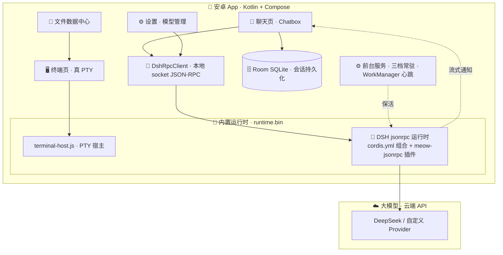

# 🐾 喵仓 MeowAcademy

[](LICENSE)

> 安卓端 AI 助手 App：在手机里内置完整的 **DeepSeek Harness（DSH）Agent 运行时**，
> 聊天问答、真终端、文件数据中心三位一体，模型走云端 API。
> 愿景是让 Markdown 笔记「会聊天、会查资料」——md 知识库 + SQLite Wiki + RAG 检索见[路线图](#️-路线图)。

| 状态 | 信息 |
| --- | --- |
| 最新版本 | [0.2.0（debug）](https://github.com/hu568/meow-academy/releases/latest) |
| 平台 | Android 8.0+（minSdk 26 / targetSdk 34） |
| 技术栈 | Kotlin · Jetpack Compose · Material 3 · Room · DataStore · Markwon |
| Agent 后端 | 内置 DeepSeek Harness 运行时（真终端 PTY + 本地 socket JSON-RPC） |
| 模型 | 云端 API（DeepSeek 官方，或任意 OpenAI 兼容自定义 Provider），无本地模型 |
| 许可证 | [GPL-3.0](LICENSE) |

---

## ✨ 功能总览（均已实现并真机验证）

### 💬 聊天 · Chatbox 化体验

- **流式对话**：思考 / 正文 / 工具调用**步骤化有序渲染**，工具调用折叠成卡片组，自动贴底跟随
- **会话管理**：毛玻璃会话抽屉、新建 / 切换 / 删除会话，顶栏快捷操作
- **会话持久化**：Room（SQLite）双表存储会话与消息，App 重启后上下文不丢（DSH 侧 `agents.resume()` 无缝恢复）
- **阅读不跳动**：上滑脱离自动滚动 + 「回到底部」按钮；看历史时冻结流式气泡
- **输入栏工具栏**：模型快切、网络搜索开关、思考强度（off / high / max）、文件上传

### 🤖 Agent 能力（内置 DSH 运行时）

- **完整 Agent 循环**：DeepSeek Harness 跑在 App 内置 Linux 运行时（`runtime.bin` ≈ 67MB）里，`linker64` 拉起 node，聊天经**本地 unix socket JSON-RPC** 通信（非 HTTP）
- **工具全可用**：`bash` / `read` / `write` / `edit` / `str_replace_editor` / `web_search`（联网搜索）/ `todo_write`
- **模型管理**：运行时热切换模型与思考强度；支持添加**自定义 Provider**（OpenAI 兼容格式），密钥存 App 私有目录、bash 子进程不可见
- **安全边界**：工作区收敛到 `filesDir/workspace`，敏感文件（密钥 / 内部数据）对 Agent 禁读

### 🖥️ 真终端

- 持久 **PTY bash** 进程（Termux 化 node 运行时内），ANSI 转义全渲染
- 与文件管理页双向联动：进入终端自动 `cd` 到当前浏览目录

### 📁 文件数据中心

- 全部文件浏览 / 打开编辑（编辑 + 预览双模式）/ 内容搜索
- **HTML 文件 WebView 预览**：点击 `.html` 进入统一编辑器，默认渲染页面（JS/CSS/相对资源可用），一键切源码编辑
- 导入 / 复制 / 移动 / 多选批量操作 / 多模式排序
- 面包屑可编辑：直接输入路径跳转；根目录语义为「工作区」，不暴露系统目录

### 📖 Markdown 渲染（JS 驱动外观）

- Markwon 渲染：表格 / 图片 / **LaTeX 公式** / Prism4j 代码着色，流式块级增量渲染不抖动
- **`appconfig/markdown-config.js` 控制渲染外观**：公式块圆角背景、列表 `·` 大小描边、代码块整块圆角、引用 / 链接 / 标题倍率 / 分割线等，FileObserver 热更
- **AI 可编排前端效果**：让 DSH 用 write 工具改 JS 配置，回到聊天页即时生效，无需重编译或重启 App（真机验证通过）

### 🎨 个性化与常驻

- **Material You**：浅色 / 深色 / 跟随系统，动态取色；自定义主题种子色
- **聊天底图**：预设底图 / 相册自定义，浅色模式自动暗纱遮罩保证可读性
- **三档常驻策略**：关闭 / 有限时间保活 / 一直常驻（前台服务 + WorkManager JSON-RPC 心跳）

---

## 🧱 技术架构



**核心链路**：App 启动 → 解压 `runtime.bin` → `linker64` 拉起 node 运行 `terminal-host.js`（内置 PTY bash）→ DSH 作为 bash 子进程运行 → 聊天 / 终端均经本地 socket 走 JSON-RPC 2.0 → 模型请求发往云端 API。

**DSH 组合与插件**：`android-app/runtime-assets/dsh/cordis.yml` 定义了喵仓的 Agent 组合（llm-deepseek / bash / agent-spine / 可配置 Provider 等）；`meow-extensions/meow-jsonrpc.js` 是自定义 Cordis 插件，扩展了官方 jsonrpc server（`session/cancel`、`session/bash`、`session/setModel`、`ping`、`agents.resume()` 跨进程会话恢复）。

**App 内目录约定**（phase4 重构后）：`workspace/` 为 Agent 工作区（DSH_CWD），`appconfig/` 存放渲染配置与 Provider 设置，`.agents/` 预留 skills / 记忆 / 插件。

> 🗺️ 每个源码模块的职责与协作关系见 [docs/module-structure.md](docs/module-structure.md)。

---

## 🚀 快速开始

### 环境要求

- JDK 17
- Android SDK（platforms;android-34 + build-tools;34.0.0）
- 真机（Android 8.0+）用于完整链路验证

> WSL 构建环境可直接 `source scripts/dev-env-wsl.sh` 一键就绪（JDK / SDK / 镜像源均已配好）。

### 构建 APK

```bash
cd android-app
./gradlew assembleDebug
```

构建产物自动同步到 `release/meow-academy-0.2.0-debug.apk`（约 88MB，内置 DSH 运行时 `runtime.bin` 约 67MB）。

### 安装到真机

```bash
adb install -r release/meow-academy-0.2.0-debug.apk
```

### 首次配置

1. 启动 App，等待内置运行时自动解压并拉起 DSH 进程
2. 在**设置页填入 `DEEPSEEK_API_KEY`**，或在**模型管理**中添加自定义 Provider（OpenAI 兼容格式 + Base URL + 密钥）
3. 回到聊天页即可对话；工具调用、联网搜索、终端、文件管理开箱即用

> 密钥只存 App 私有目录并通过环境变量注入运行时，**不硬编码**、不进仓库、bash 子进程不可见。

---

## 🔧 重打内置运行时（进阶）

内置 DSH 运行时以 `runtime.bin`（gzip 打包的闭包）存放于 `android-app/app/src/main/assets/`。改动 `cordis.yml` / `meow-extensions/` 或升级 DSH 后需重打，分两步：

```bash
# 1. PC 端：从仓库内 DSH fork 生成闭包（需 node + pnpm）
bash android-app/runtime-assets/build-dsh-closure.sh   # 产物 .tmp/dsh-closure.tar.gz

# 2. 真机 Termux：打包成 runtime.bin 并拷回 assets（需 nodejs-lts + bash + binutils）
adb push .tmp/dsh-closure.tar.gz android-app/runtime-assets/build-runtime.sh android-app/runtime-assets/dns-shim.js /data/local/tmp/
adb shell 'cp /data/local/tmp/dsh-closure.tar.gz /data/local/tmp/build-runtime.sh /data/local/tmp/dns-shim.js ~/ && chmod +x ~/build-runtime.sh && ~/build-runtime.sh ~/dsh-closure.tar.gz'
adb shell 'cp ~/runtime.bin /data/local/tmp/' && adb pull /data/local/tmp/runtime.bin android-app/app/src/main/assets/runtime.bin
```

> ⚠️ 压缩包必须命名为 `runtime.bin`（AGP 会对 `.gz` 后缀的 assets 自动解压改名）；替换后建议 `clean assembleDebug`，避免增量打包体积膨胀。
> 对 DSH 的定制走 **Cordis 插件化**（改 `cordis.yml` / `meow-extensions/`），不 fork DSH 源码。

---

## 📁 仓库结构

```
meow-academy/
├── README.md                       # 📖 本文件
├── PLAN.md                         # 📋 主线开发计划
├── docs/
│   ├── decision-dsh-agent.md       # 🧩 方案决策：Pi → DSH 替换 + 插件化机制
│   ├── decision-local-pi-agent.md  # 🐧 方案决策：Pi 本地化 + 终端驻留
│   ├── design-gui.md               # 🎨 GUI 设计：信息架构 v1
│   ├── module-structure.md         # 🗺️ 安卓端模块地图
│   ├── notes/                      # 📝 DSH 能力盘点 / 动态架构笔记
│   └── reference/                  # 📚 RAG 算法 / Cherry Studio / RikkaHub 参考
├── android-app/                    # 📱 安卓端
│   ├── app/src/main/java/com/meow/academy/
│   │   ├── ui/                     # Compose：聊天 / 文件 / 终端 / 设置 / 主题
│   │   ├── data/                   # Room 会话库 + DataStore 设置 + 文件/模型仓库
│   │   ├── rpc/                    # DshRpcClient：本地 socket JSON-RPC 客户端
│   │   └── runtime/                # 运行时：解压 / 拉起 / 前台服务 / 心跳保活
│   ├── app/src/main/assets/        # runtime.bin（gitignore）+ appconfig/markdown-config.js
│   ├── app/schemas/                # Room schema 导出（迁移用）
│   └── runtime-assets/             # cordis.yml + meow-jsonrpc 插件 + 闭包打包脚本
├── release/                        # 📦 APK 产物 + 版本更新记录（RELEASE_NOTES_*.md）
├── scripts/dev-env-wsl.sh          # 🛠️ WSL 构建环境一键配置
└── dsh/                            # 🧩 DSH 独立 fork（gitignore，仅本地打闭包用）
```

---

## 📚 文档索引

| 文档 | 内容 |
| --- | --- |
| [PLAN.md](PLAN.md) | 主线开发计划：功能清单、架构、RAG 流程设计、里程碑 |
| [docs/module-structure.md](docs/module-structure.md) | 安卓端模块地图：每个文件的职责、依赖与扩展指引 |
| [docs/decision-dsh-agent.md](docs/decision-dsh-agent.md) | Pi Agent → DeepSeek Harness 替换的决策与实施 |
| [docs/decision-local-pi-agent.md](docs/decision-local-pi-agent.md) | Pi 本地化 + 终端驻留决策 |
| [docs/design-gui.md](docs/design-gui.md) | GUI 信息架构设计 v1 |
| [docs/notes/meow-dynamic-architecture-note.md](docs/notes/meow-dynamic-architecture-note.md) | 动态架构笔记：Markdown 渲染 JS 化等 |
| [docs/notes/embedded-dsh-capabilities.md](docs/notes/embedded-dsh-capabilities.md) | 内置 DSH 运行时能力盘点 |
| [docs/reference/](docs/reference/) | RAG 算法 / Cherry Studio / RikkaHub 参考实现 |
| [release/RELEASE_NOTES_0.2.1.md](release/RELEASE_NOTES_0.2.1.md) | 版本更新记录（最新） |

---

## 🗺️ 路线图

1. **知识库与 RAG（M5）**：md 文件导入 / 文件夹扫描 → SQLite Wiki（标题 / 标签 / 全文检索）→ Kotlin 端分块（~300 字 / 50 字重叠）→ bge-m3 向量化 → 余弦检索 top-5 → 回答标注引用来源
2. **联调与打包（M6）**：体积优化（≤200MB）、混淆、正式签名 release 包
3. **增强（M7）**：双模型配置同步、Rerank 重排序、MCP 服务器接入、语音输入 / TTS、学习进度追踪、云同步

---

## 📄 许可证

本项目基于 [GPL-3.0](LICENSE)（GNU General Public License v3.0）发布。

- 任何基于本项目的二次分发 / 修改版，须同样以 GPL-3.0 开源，并保留版权与许可声明
- 本程序按「现状」提供，不含任何形式的担保（详见 LICENSE 第 15、16 节）
- 内置的 DeepSeek Harness（DSH）运行时闭包（`runtime.bin`）属于上游独立项目，遵循其自身的许可条款；本仓库对 DSH 的组合配置与插件（`cordis.yml` / `meow-extensions/`）随本项目以 GPL-3.0 发布
